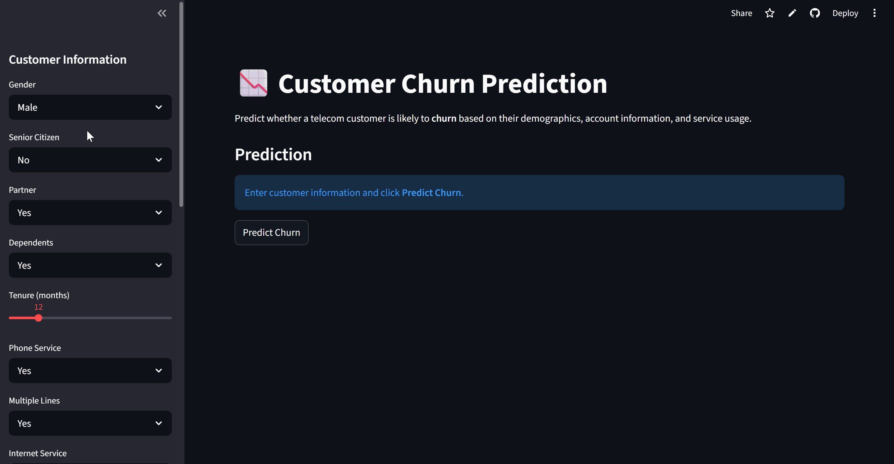

# Customer Churn Prediction using Machine Learning

## Demo

---

## Overview

Customer churn is a major challenge for companies operating in competitive industries such as telecommunications, banking, and subscription-based services. Acquiring new customers is significantly more expensive than retaining existing ones, making churn prediction an important business problem.

This project develops an end-to-end machine learning pipeline to predict whether a telecom customer is likely to churn based on demographic information, account details, and service usage patterns.

The project also includes a Streamlit web application that allows users to interactively predict customer churn.

---

## Problem Statement

The objective of this project is to build a machine learning model that predicts whether a customer will churn.

Using historical customer data, the model analyzes:

- Customer demographics
- Account information
- Service usage patterns

The goal is to identify customers likely to discontinue services, allowing companies to implement proactive retention strategies.

---

## Dataset

Dataset used: Telco Customer Churn Dataset

Source:  
https://www.kaggle.com/datasets/blastchar/telco-customer-churn

### Dataset Features

Customer Demographics
- Gender
- Senior Citizen
- Partner
- Dependents

Account Information
- Tenure
- Contract Type
- Payment Method
- Billing Details

Service Usage
- Internet Service
- Phone Service
- Streaming Services
- Online Security

Target Variable
- Churn (Yes / No)

---

## Project Workflow

### Data Cleaning

- Converted `TotalCharges` to numeric
- Handled missing values
- Removed unnecessary columns (`customerID`)
- Standardized categorical values

### Exploratory Data Analysis

Key visualizations include:

- Churn distribution
- Contract type vs churn
- Tenure vs churn
- Monthly charges vs churn
- Internet service vs churn
- Payment method vs churn
- Correlation heatmap

Key observations:

- Customers with month-to-month contracts show the highest churn
- Customers with low tenure are more likely to churn
- Higher monthly charges increase churn probability
- Fiber optic users churn more frequently
- Electronic check payments correlate with higher churn

---

## Machine Learning Models

The following models were trained and compared:

- Logistic Regression
- Decision Tree
- Random Forest

### Preprocessing Pipeline

The pipeline includes:

- StandardScaler for numerical features
- OneHotEncoder for categorical features
- ColumnTransformer for preprocessing
- Pipeline to combine preprocessing and modeling

### Cross Validation

- Stratified K-Fold Cross Validation
- 5 folds
- ROC-AUC used as the primary evaluation metric

---

## Model Evaluation

Models were evaluated using:

- Accuracy
- Precision
- Recall
- F1 Score
- ROC-AUC Score

ROC-AUC was used as the main metric because churn datasets are typically imbalanced.

### Model Performance

| Model | Accuracy | Precision | Recall | F1 Score | ROC-AUC |
|------|------|------|------|------|------|
| Logistic Regression | 0.778 | 0.566 | 0.764 | 0.650 | **0.848** |
| Random Forest | 0.780 | 0.573 | 0.740 | 0.646 | 0.841 |
| Decision Tree | 0.737 | 0.509 | 0.780 | 0.616 | 0.828 |

Best performing model: Logistic Regression (ROC-AUC = 0.848)

---

## Threshold Optimization

Instead of using the default probability threshold (0.5), the optimal threshold was determined using the ROC curve by maximizing Youden’s J statistic:

J = TPR − FPR

This improves the balance between identifying churners and minimizing false positives.

---

## Feature Importance

The most influential features affecting churn include:

- Tenure
- Internet Service
- Monthly Charges
- Contract Type
- Total Charges

These insights help businesses design targeted retention strategies.

---

## Streamlit Application

The project includes a Streamlit web application that allows users to interactively predict customer churn.

Users can input customer information such as tenure, contract type, payment method, and service usage to estimate churn probability.

---

## Running the App Locally

Install dependencies:
pip install -r requirements.txt

Run the Streamlit application:
streamlit run app.py

The application will open in your browser at:
http://localhost:8501

---

## Project Structure

customer-churn-prediction-ml               
│                 
├── app.py          
├── churn_model.pkl          
├── customer_churn_prediction.ipynb        
├── customer_churn_report.pdf         
├── Customer_Churn.csv        
├── requirements.txt           
└── README.md       

---

## Technologies Used

Programming Language
- Python

Libraries
- Pandas
- NumPy
- Matplotlib
- Seaborn
- Scikit-learn
- Streamlit
- Joblib

---

## Author

Deepanshu Sati  
Chemical Engineering Undergraduate  
NIT Hamirpur
